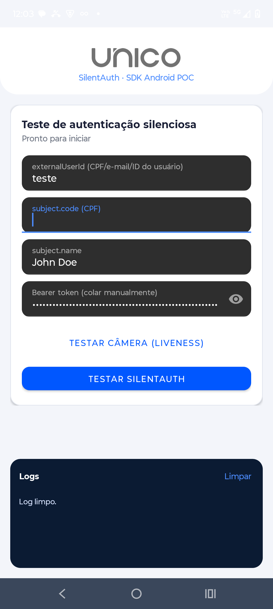

<p align="center">
  <a href="https://unico.io">
    
  </a>
</p>

<h1 align="center">Smart Revalidation (SilentAuth) — SDK Android POC</h1>

<div align="center">

### POC de teste ponta a ponta da autenticação silenciosa de device (SilentAuth) via SDK Android


</div>

---

## 🎯 O que esta POC faz

Este projeto testa o fluxo de **autenticação silenciosa de device** (SilentAuth):

1. O app chama `prepareCamera` da SDK Android passando um `PrepareInfo(externalUserId)`. Isso inicia uma coleta de dados de device **em background** — sem abrir a câmera nem exigir nenhuma captura do usuário.
2. Alguns segundos depois, o app chama o endpoint `POST /processes/v1` usando o **mesmo `externalUserId`**, cru, junto com os dados do `subject` (documento/nome).
3. O backend localiza a coleta feita no passo 1 a partir desse identificador e retorna se o device foi validado silenciosamente.

A tela permite rodar os dois passos e acompanhar o resultado da chamada no painel de logs.

<p align="center">
  
</p>

> ⚠️ O `externalUserId` usado no passo 1 e no passo 2 precisa ser **idêntico, char a char**. Qualquer diferença faz a busca falhar silenciosamente (retorno inconclusivo, sem erro).
>
> ⚠️ A coleta de device tem uma janela de validade curta e só pode ser usada uma vez. Se o teste vier inconclusivo, gere uma nova coleta (botão "Testar SilentAuth" de novo) antes de tentar o processo.

---

## 💻 Compatibilidade

- **Android:** 7.0 (API nível 24) ou superior
- **Kotlin:** 2.2
- **Dispositivo físico** — SDKs de biometria/device intelligence da Unico não funcionam em emulador.

---

## ⚙️ Configuração antes de rodar

Este repositório **não contém nenhuma credencial real**. Antes de compilar, substitua os placeholders abaixo pelos valores do seu ambiente:

| Onde | O que trocar | Valor |
| --- | --- | --- |
| `app/build.gradle` | `applicationId` e `namespace` | Seu bundle identifier registrado na Unico |
| `UnicoConfig.kt` | `getBundleIdentifier()` | O mesmo bundle identifier acima |
| `UnicoConfig.kt` | `getHostKey()` | Sua **SDK Key** (Client API Key), com a capability SilentAuth habilitada |
| `MainActivity.kt` | `apiKey` | Sua **API Key**, com a capability SilentAuth habilitada |

O **access token (Bearer)** **não é hardcoded** — cole-o diretamente no campo "Bearer token" da tela antes de rodar o teste, já que costuma ter validade curta.

Para gerar as credenciais Unico, consulte a [documentação oficial](https://developer.unico.io/).

---

## 📦 Instalação

### 🔒 Permissões

Já configuradas no `AndroidManifest.xml`:

```xml
<uses-permission android:name="android.permission.CAMERA" />
<uses-permission android:name="android.permission.INTERNET" />
```

### 📥 Dependência da SDK

Configurada em `app/build.gradle`:

```gradle
implementation "io.unico:capture:<version>"
```

Substitua `<version>` pela versão mais atual da SDK Android, se necessário.

---

## ▶️ Como usar

1. Abra o projeto no Android Studio e substitua os placeholders da seção [Configuração](#️-configuração-antes-de-rodar).
2. Conecte um dispositivo físico e rode o app.
3. Preencha o `externalUserId` (identificador do usuário no seu sistema — CPF, e-mail ou ID interno) e os dados de `subject`.
4. Toque em **"Testar SilentAuth"** — a permissão de câmera será solicitada na primeira vez, mesmo sem abrir a interface de câmera.
5. Cole o **Bearer token** válido no campo correspondente.
6. Acompanhe o painel de **Logs** para ver a resposta do `POST /processes/v1`.

O botão **"Testar câmera (Liveness)"** é independente do fluxo SilentAuth — serve apenas para validar que a SDK está integrada corretamente (abre a câmera e executa uma captura normal).

---

## 🤔 Dúvidas

Em caso de conflito de biblioteca com a SDK, abra um chamado na plataforma oficial de Suporte da Unico. Para dúvidas gerais de integração, consulte a [documentação oficial](https://developer.unico.io/).
